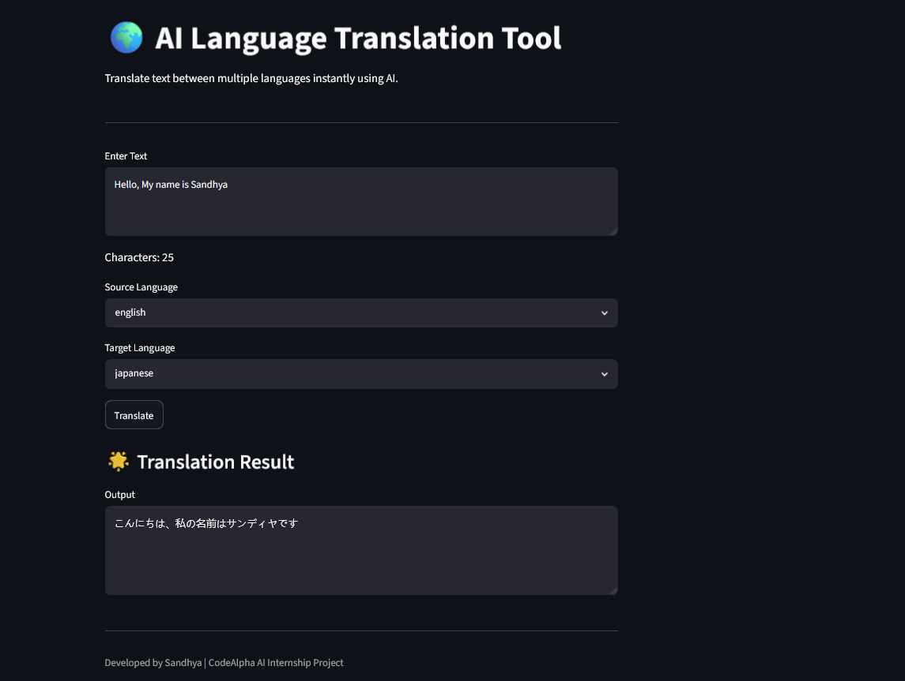

# 🌍 AI Language Translation Tool

## Overview
This project is an AI-powered Language Translation Tool developed as part of the CodeAlpha Artificial Intelligence Internship.

## Features
- Translate text between multiple languages
- User-friendly interface
- Real-time translation
- Character counter

## Technologies Used
- Python
- Streamlit
- Deep Translator

## How to Run

Install libraries:

pip install streamlit deep-translator

Run the project:

streamlit run app.py

## Author
Sandhya
## Project Screenshot

